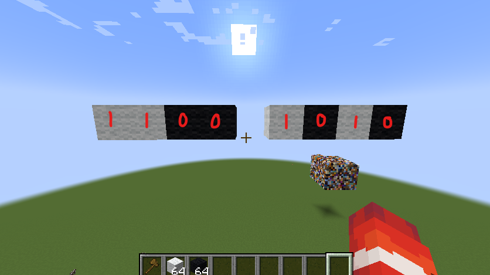
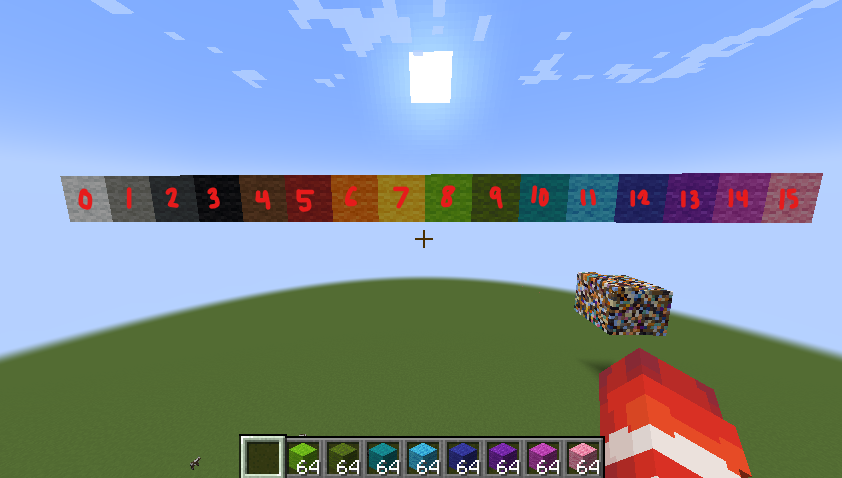
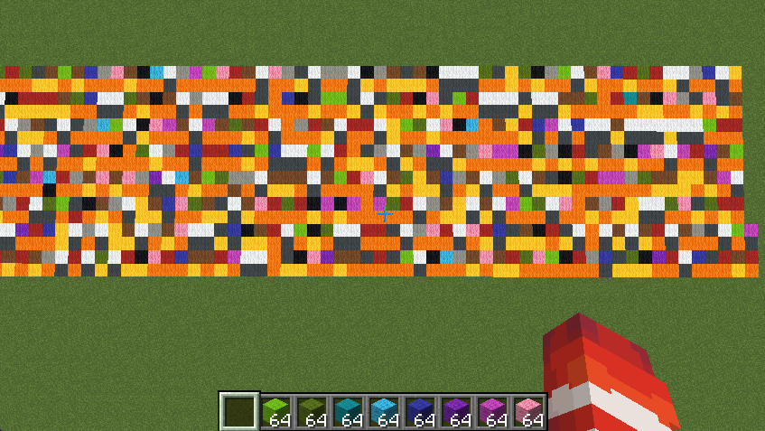
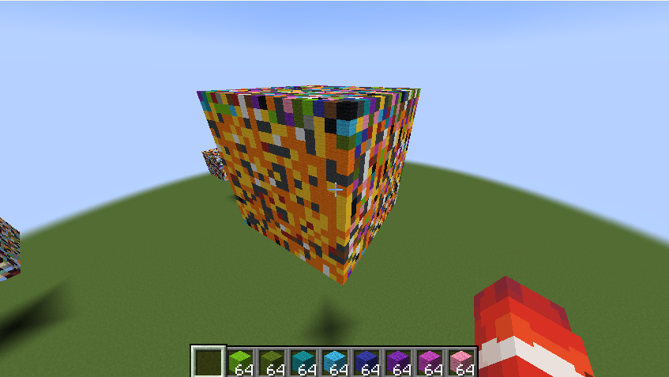
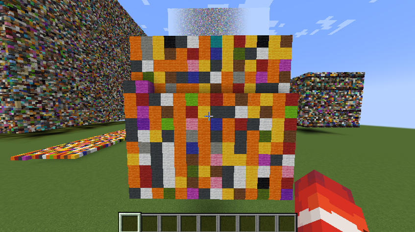
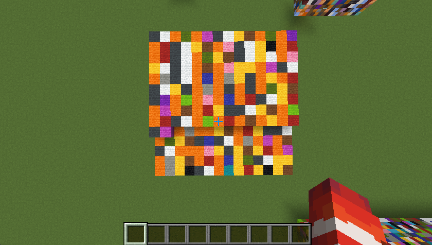
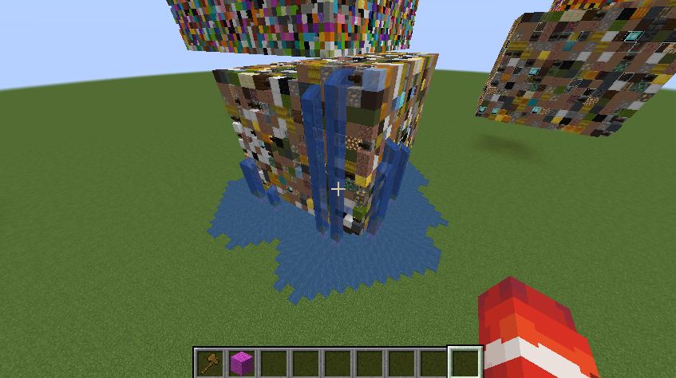

# Presentation 

## Mapping Bits to Blocks 

Since files are essentially just a series of bits, we can represent files in Minecraft as a series of blocks. 

For example, at the simplest form, we can use two different blocks, one to represent the value `0`, and the other to represent the value `1`. 

The number `202` in binary is `1100 1010`. Substituting **0** for **black wool** and **1** for **white wool**, the number would like this: 

To save a little bit of space, I decided to use 16 different blocks (16 different colors of wool), with each block representing 4 bits. 

This way, every pair of blocks would represent a byte. Any given block could have 16 possible values (0-15), and any pair of blocks could hold 16 * 16 = 256 possible values (0-255). 

## Encoding a File

In Minecraft, a selection of blocks can be stored into what is called a schematic file. 

After reading a file and converting the data from bytes to blocks, the blocks are saved in a Minecraft schematic file which can then be loaded into a world.  

I initially laid the data out in a 2d array of blocks, although I later scaled that up into 3 dimensions to be more space efficient. 

*^ This is a plain text file* 

*^ Plain text file stored as a cube* 

I encoded blocks in the order *x, z, y*, all in the positive direction. The order in which blocks are encoded could be changed around, and anyone trying to crack the file would need to decode the blocks in the same order they were placed in. 

Since the number of bytes in a file doesn't always fill a complete cubic shape though, there are often missing blocks at the end of the file, which allow us to easily determine the order in which the blocks were placed. 

*^ x-y-z order* (block layers piled horizontally)

*^ x-z-y order* (block layers piled vertically)

To fix this, I appended random blocks to the end of the schematic to fill up the remaining space. 

However, this also introduces another problem: in order to decode the schematic, you would need to know the size of the original file. 

In the encoding process, I decided to have the first 8 blocks of the file store a 32-bit integer (1 block = 4 bits), which could then be read to determine the file size and decode the rest of the blocks. 

## Decoding Minecraft Blocks 

To decode an array of blocks, we would reverse this process. The blocks are first saved to a schematic file, from which the blocks are read and converted to an array of bytes. The extra bytes from the encoding are ignored since they weren't part of the original file.

## Adding Layers of Obsfucation 

### Modifying Encode Order 

Instead of placing blocks in a linear pattern (*x, z, y*), the blocks could be placed in a random order based off a key. Using python's `random` module, the positions of the encoded blocks can be shuffled using the `shuffle()` function. To decode the schematic, you would need to know the seed used to shuffle the blocks, which could be used to rearrange the bytes of the file to it's original order. 

### Incoporating Extraneous Blocks 

I encoded the file using the 16 different colored wool blocks, but Minecraft has over 800 unique blocks that can be used to represent more data. Including blocks outside of these 16 wool blocks in the schematic would require someone decoding the schematic to have knowledge of the full block list used. Adding random blocks does come at the cost of taking up more space though, and the original block list could probably determined quite easily using some frequency anaylysis, depending on how many different random blocks are included. 

#### Note

You do have to be careful about the blocks used to encode the data, as not all blocks in Minecraft have a fixed state. One of my files got corrupted because I used ice blocks, which eventually melted. 

These are some of the blocks that I have determined don't work:

- any blocks affected by gravity (sand, gravel, concrete powder)
- blocks that must be placed on other blocks (beds, doors, lanterns)
- blocks that can spread to other blocks (dirt, grass, mycelium)
- snow + carved pumpkin and iron block + carved pumpkin (possibility of spawning a snow/iron golem if placed in a specific way, removing the blocks)

-----------
In theory, the data could be further compressed by using more blocks. With more blocks, each 1x1x1 space in the Minecarft world could represent more bits of data. Some blocks also contain additional data, such as their orientation (e.g. stairs), which could effectively be used to increase the amount of data stored in a series of blocks. 